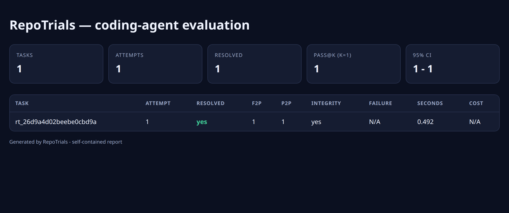
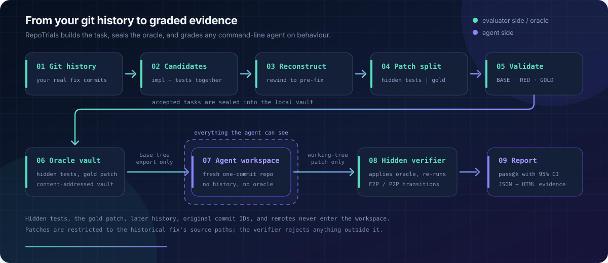

<p align="center">
  
</p>

<h1 align="center">RepoTrials</h1>

<p align="center">
  <strong>SWE-bench for your own repository: mined from your git log, graded on your machine.</strong>
</p>

<p align="center">
  <a href="https://github.com/PozziTiv4ik/Repo-Trials/actions/workflows/ci.yml"></a>
  <a href="https://github.com/PozziTiv4ik/Repo-Trials/actions/workflows/codeql.yml"></a>
  <a href="https://github.com/PozziTiv4ik/Repo-Trials/releases/latest"></a>
  <a href="https://github.com/users/PozziTiv4ik/packages/container/package/repo-trials"></a>
  <a href="https://github.com/PozziTiv4ik/Repo-Trials/tree/main/docs"></a>
  <a href="https://www.python.org/downloads/"></a>
  <a href="LICENSE"></a>
  <a href="https://codespaces.new/PozziTiv4ik/Repo-Trials"></a>
</p>

RepoTrials finds the commits where your team fixed a bug and added a test, rewinds the repository to the moment before the fix, hides the test, and scores any command-line agent on whether it can pass it. Public leaderboards tell you which agent wins in general. RepoTrials tells you which configuration can be trusted on your codebase — and it can do that because the engine is public while your test split, hidden tests, and reference patches never leave your disk.

```text
real fix commit → sealed task → equal trials → hidden verifier → evidence
```

<p align="center">
  <a href="#try-it-in-60-seconds"><strong>Try the demo</strong></a> ·
  <a href="#the-validation-contract">See how grading works</a> ·
  <a href="#requirements-and-install">Build your benchmark</a> ·
  <a href="#point-it-at-any-coding-agent">Wire up your agent</a> ·
  <a href="docs/threat-model.md">Read the threat model</a>
</p>

## Try it in 60 seconds

No config, no API key, no Docker, no clone. This builds a real two-commit Git repository, mines it, runs BASE/RED/GOLD validation, then puts a deliberately broken agent and a working agent against the same sealed task:

```bash
uvx --with pytest --from git+https://github.com/PozziTiv4ik/Repo-Trials repotrials demo
```

`--with pytest` is there because the *generated fixture repository* runs pytest, not because RepoTrials does. RepoTrials itself has zero third-party runtime dependencies.

It finishes in a few seconds and echoes every CLI call it makes. The last lines it prints:

```text
noop-agent  0/1 trials resolved
fix-agent   1/1 trials resolved
delta       +100 percentage points

Demo complete: /tmp/repotrials-demo-q_9hibqw
Open report:   /tmp/repotrials-demo-q_9hibqw/demo-repository/.repotrials/reports/demo/report.html
```

That HTML file is a self-contained report: pass@k with a bootstrap 95% confidence interval, and a per-attempt table with fail-to-pass counts, integrity result, failure kind, and runtime. A complete benchmark loop, end to end, before you have decided whether to trust the project.



<sub>The bundled demo mines a single task, so the report above shows one row. A real repository produces one row per task per attempt.</sub>



No `uv`? Clone and install instead — same result:

```bash
git clone https://github.com/PozziTiv4ik/Repo-Trials.git
cd Repo-Trials
python -m venv .venv && source .venv/bin/activate
python -m pip install ".[dev]"   # [dev] only because the fixture repo runs pytest
repotrials demo
```

Full walkthrough, including Windows and pointing it at your own repository: [docs/quickstart.md](docs/quickstart.md).

## How it works

RepoTrials scans local Git history for commits that changed implementation **and** Python tests together, reconstructs the tree immediately before the fix, and splits the commit into a hidden test patch and a reference "gold" patch. It then proves the task is worth using by executing it: the old code must pass its own tests, fail once the hidden tests are added, and pass once the historical fix is applied.

The hidden tests, the gold patch, and the raw logs go into a local content-addressed vault. `repotrials vault verify` hash-checks every object.



**The trust boundary is the point.** The agent receives a `git archive` export of the base tree wrapped in a fresh one-commit synthetic repository: no later history, no original commit IDs, no remotes, no gold patch, no hidden tests. Exactly two things cross the boundary — a base tree going in, a working-tree diff coming back. Grading happens afterwards, in a separate verifier workspace the agent never saw, using evaluator-owned commands.

That separation defends the oracle against a normally-behaving agent. It is not a sandbox against a hostile one; see [the threat model](docs/threat-model.md).

## Point it at any coding agent

`--agent-command` is the whole integration surface. No plugin, no SDK, no adapter class. RepoTrials never contacts a model provider itself — your agent does.

```bash
repotrials run --agent-command "$PWD/recipes/claude-code.sh" --name claude-code --unsafe-local
```

| Agent | Wrapper | What the wrapper runs |
|---|---|---|
| Claude Code | `recipes/claude-code.sh` | `claude --bare -p "<task>" --allowedTools "Read,Edit,Bash" --permission-mode acceptEdits --max-turns 40` |
| OpenAI Codex CLI | `recipes/codex.sh` | `codex exec --sandbox workspace-write --ephemeral --skip-git-repo-check --ignore-user-config "<task>"` |
| Cursor CLI | `recipes/cursor-agent.sh` | `cursor-agent -p --force --output-format text "<task>"` |
| Aider | `recipes/aider.sh` | `aider --message "<task>" --yes-always --no-auto-commits --no-auto-test` |
| Amp | `recipes/amp.sh` | `amp -x "<task>"` |
| mini-swe-agent | `recipes/mini-swe-agent.sh` | `mini -t "<task>" -y --exit-immediately -m <model>` |

Seventeen wrappers ship in [`recipes/`](recipes/README.md), plus `generic.sh` as a template for your own scaffold.

**Honesty note:** those invocations were read from each vendor's published non-interactive reference in August 2026. **None of them has been executed end to end against a RepoTrials task by this project** — the only agents exercised in CI are the two synthetic ones in the bundled demo. Treat a run of all zeros as a wiring bug until you have proven otherwise; the report's failure-kind column tells you which. One flag is ours, not the vendor's: `claude-code.sh` caps the run at `--max-turns 40` (override with `RT_MAX_TURNS`; Claude Code itself imposes no limit by default, and exits non-zero when the cap is hit, which RepoTrials records as `agent_exit`). No other recipe sets a turn budget, so a Claude Code run and a Codex CLI run in this table are not budget-matched out of the box.

[docs/agents.md](docs/agents.md) documents the execution contract in full: the four `REPOTRIALS_*` environment variables, the `{workspace}` and `{instruction}` placeholders, why there is no shell in front of your command, every failure kind, and how to turn two runs into a defensible comparison.

## Use it in CI

A composite action ([`action.yml`](action.yml)) runs the agent, writes the reports, compares against a baseline run group, and fails the job when the candidate loses more ground than you allow:

```yaml
- uses: actions/checkout@v7
- uses: PozziTiv4ik/Repo-Trials@main        # pin to a full commit SHA
  env:
    ANTHROPIC_API_KEY: ${{ secrets.ANTHROPIC_API_KEY }}
  with:
    agent-recipe: claude-code
    agent-name: candidate
    baseline-run-group: ${{ steps.baseline.outputs.run-group }}
    fail-on-regression: '5pp'
    unsafe-local: 'true'
```

The action runs and reports; it does not mine, validate, or accept tasks, because those need human judgement. `report.json` and `report.html` are safe to publish. `.repotrials/` is not — it holds hidden tests, gold patches, and source snapshots.

See [docs/ci.md](docs/ci.md) for getting the task set onto a runner, the security consequences on a hosted runner, and [a copy-pasteable workflow](.github/workflows/example-agent-regression.yml).

## What you get

- **Behavioral grading.** Real JUnit `FAIL_TO_PASS` and `PASS_TO_PASS` transitions, never gold-diff similarity. A patch that looks nothing like the human fix scores exactly the same as one that matches it character for character.
- **Leak-resistant workspaces.** Agents receive a one-commit synthetic repository without future Git objects, hidden tests, or the human solution.
- **Auditable artifacts.** Explicit settings, content-addressed vault objects, four versioned JSON Schemas, and machine-readable run records. `compare` refuses two cohorts whose task sets, digests, attempt shapes, or execution profiles differ, rather than quietly averaging them.
- **Local by default.** Private source and oracle data stay under `.repotrials/`; nothing is uploaded by RepoTrials. For real isolation, `export-harbor` writes the sealed task with a separate no-network [Harbor](https://github.com/harbor-framework/harbor) verifier.

## The validation contract

For a base revision `B`, hidden test patch `T`, and historical gold patch `S`, RepoTrials checks:

```text
BASE   B       + original tests   -> pass
RED    B       + T                -> at least one relevant failure
GOLD   B + S   + T                -> pass
NOOP   B       + T                -> not resolved
```

During agent evaluation, the agent works on a clean export of `B` without the later Git history or vault. In a separate grading step, the verifier applies the agent patch and hidden tests, runs the frozen setup, and then executes evaluator-owned tests. A task is resolved only when all fail-to-pass tests pass and the protected regression tests remain passing.

The score is behavioral rather than a comparison with the gold diff. As a conservative v0.1 integrity rule, however, the evaluated patch may touch only the task's frozen `source_files`: the implementation paths changed by the historical fix. Local verification rejects an outside path; Harbor captures the complete bounded Git diff and its separate verifier rejects any outside or protected path. Either way, a solution that needs a new helper path cannot pass. Review the frozen path set along with the task, and see the [roadmap](docs/roadmap.md) for broader reviewed allowlists.

Execution establishes a reproducible signal; it does not by itself establish that the issue description and tests are aligned. Candidates intended for comparison should be reviewed before acceptance.

## Requirements and install

Git, Python 3.11 or newer, whatever the target repository needs to install and test itself, and an isolated machine, VM, or container for code you do not fully trust. Harbor and third-party coding agents are optional and are not bundled. The RepoTrials core has zero third-party runtime dependencies; contributor tools live in the `[dev]` extra.

The portable v0.1 evaluation contract targets Linux/amd64. The CLI installs and runs on Windows and macOS, but a local validation there is not evidence of equivalence to the exported Linux image; use matching Docker validation before comparison or Harbor export.

RepoTrials is not on PyPI. Install the released wheel straight from GitHub Releases:

```bash
python -m pip install https://github.com/PozziTiv4ik/Repo-Trials/releases/download/v0.1.0/repotrials-0.1.0-py3-none-any.whl
repotrials --help
```

Or use the public Linux/amd64 container, which bundles Git and runs as an unprivileged user:

```bash
docker run --rm ghcr.io/pozzitiv4ik/repo-trials:0.1.0 --version
```

Pin the OCI digest instead of the version tag for an immutable pull. The published image carries BuildKit provenance and an SBOM — see the [package page](https://github.com/users/PozziTiv4ik/packages/container/package/repo-trials).

To follow `main` or contribute, install from source:

```bash
git clone https://github.com/PozziTiv4ik/Repo-Trials.git
cd Repo-Trials
python -m venv .venv && source .venv/bin/activate
python -m pip install .
repotrials --help
```

> `repotrials demo` and the `uvx` one-liner above land in the next release. On v0.1.0 the equivalent is `python scripts/demo.py` from a source checkout.

Then, in a **disposable clone** of the repository you want to measure — validation reconstructs historical states and executes their tests:

```bash
repotrials init                  # write repotrials.toml and .repotrials/
                                 # review setup, test command, and path globs
repotrials doctor                # check Git, Docker, Harbor, repository, state
repotrials mine --limit 100      # discover historical candidate fixes
repotrials validate --accept --unsafe-local
repotrials review                # triage, then `review --verify <task-id>`
repotrials run --agent-command "<command>" --name <label> --unsafe-local
repotrials report <run-group>
repotrials compare <baseline-run-group> <candidate-run-group>
```

`--unsafe-local` is a deliberate acknowledgement that historical setup, historical tests, and the agent command are not sandboxed: they inherit the invoking user's host access and network. `validate --backend docker` narrows the blast radius for the validation half, but Docker is not a hardened boundary for hostile code either. For an isolated agent run, use `export-harbor` and execute in a sandbox provider that is an actual boundary.

Keep `.repotrials/` out of the target repository's commits. `run` prints a unique run-group identifier; use that for reports and comparisons, never the agent label, which can match several historical groups and is rejected as ambiguous.

Long form: [quickstart](docs/quickstart.md) · [configuration reference](docs/configuration.md) · [FAQ](docs/faq.md).

## How it compares

RepoTrials complements existing projects rather than replacing them. Most of them are older, larger, and far more externally validated.

| Project | Primary purpose | How RepoTrials differs |
|---|---|---|
| [SWE-bench](https://github.com/SWE-bench/SWE-bench) | Evaluate agents on a maintained public corpus of real GitHub issues | RepoTrials generates a private corpus from one repository's own history |
| [SWE-rebench](https://github.com/SWE-rebench) | Continuously collect large, cross-repository executable datasets | RepoTrials optimizes for local ownership, reviewability, and repository-specific comparison |
| [SWE-smith](https://github.com/SWE-bench/SWE-smith) | Generate large-scale training tasks, including synthetic breakages | RepoTrials v0.1 mines historical human fixes and keeps the verifier private |
| [Harbor](https://github.com/harbor-framework/harbor) | Run agent evaluations and RL environments in standardized sandboxes | RepoTrials creates and validates repository-specific tasks and can export them to Harbor |
| [RepoAgentBench](https://github.com/HumphreySun98/repoagentbench) | Turn merged pull requests into local, replayable agent benchmarks | RepoTrials mines local Git history without requiring a GitHub PR, and emphasizes independent BASE/RED/GOLD validation plus strict cohort compatibility |

The reasonable posture is one public benchmark for general capability plus one private repository-specific set for transfer — not one instead of the other. [docs/comparison.md](docs/comparison.md) covers hosted services, polyglot benchmarks, and the cases where another tool is simply the better choice.

> **Project status:** v0.1.0 is the first public release. RepoTrials is under active development, and its command names and task schema may change before 1.0. Do not use current scores as a security or procurement certification.

## What v0.1 does not claim

- It does not prove that every mined task is fair or fully specified. Human review remains part of the trusted workflow.
- It does not yet accept every behaviorally valid patch shape. v0.1 freezes the editable source-file set to paths touched by the historical human fix, so a solution that adds a new helper path is rejected even when its behavior would be correct.
- It does not guarantee freedom from model-training contamination, especially for public repositories.
- It does not support every language, test runner, monorepo, service dependency, or historical build environment.
- It does not reconstruct a complete Git checkout. v0.1 snapshots with `git archive`: `export-ignore` may omit tracked files, while submodule contents, hydrated Git LFS objects, and repository symlinks are unsupported. Review and reject candidates that depend on them.
- It is not a hardened sandbox for hostile code. Repository tests and agent commands are arbitrary programs; run them in an isolated environment.
- It does not upload repositories, tasks, or results to a hosted service by default.

Automatic validation is not a fairness decision. Validated tasks land in tier `auto`, not `verified`; promotion is a separate human command, and v0.1 records a tier and a timestamp but no reviewer identity, rationale, or signature. See [the methodology](docs/methodology.md) for acceptance rules and the [human review rubric](docs/methodology.md#human-review-rubric).

## Privacy and safety

RepoTrials is local-first, but local does not automatically mean confidential or safe.

- An agent command inherits the permissions of the user that starts it.
- A hosted model provider may receive prompts or source code passed by the selected agent.
- Historical tests may execute network calls, destructive scripts, or resource-intensive workloads.
- The v0.1 vault separates verifier artifacts from the agent workspace; it is not a cryptographic secret manager.
- The generated Harbor agent image currently leaves `USER root` in effect inside the container unless the downstream provider overrides it; the container/provider must remain the security boundary.

Use a dedicated clone, remove credentials, disable unnecessary network access, impose resource limits, and read [SECURITY.md](SECURITY.md) before running third-party code.

## Interpreting results

Each attempt receives a binary resolved/not-resolved result. `report` computes empirical task-level `pass@k`: a task is resolved when any of its `k` recorded attempts resolves it, and the primary rate is the macro fraction of resolved tasks. This is the observed result for the attempts actually run, not a combinatorial estimator from a larger sample. Reports print a deterministic bootstrap 95% confidence interval and the task count next to it, precisely so a four-task result looks like a four-task result.

The short message printed by `run` is an attempt-level `resolved/trials` count. Use the run-group report for the canonical task-level aggregate.

Record the complete evaluation configuration alongside any score you keep: model and model revision, agent/scaffold version, prompt and tool configuration, token and wall-clock budget, the run-group identifier plus task-content and task-contract digests, the RepoTrials version, and the operating system and test environment. The comparator enforces the mechanical half of that list; model and provider settings outside the recorded execution profile still require operator review. See [methodology](docs/methodology.md#scoring-and-comparison).

## Documentation

[Quickstart](docs/quickstart.md) · [Agents](docs/agents.md) · [CI](docs/ci.md) · [FAQ](docs/faq.md) · [Configuration](docs/configuration.md) · [Architecture](docs/architecture.md) · [Methodology](docs/methodology.md) · [Task and result formats](docs/task-format.md) · [Threat model](docs/threat-model.md) · [Comparison](docs/comparison.md) · [Roadmap](docs/roadmap.md) · [Releasing](docs/releasing.md)

Run `repotrials <command> --help` before automating anything. The CLI is still pre-1.0, and the help text is authoritative for flags and paths.

## Contributing

Bug reports, task-quality cases, documentation improvements, and narrowly scoped adapters are welcome. Please read [CONTRIBUTING.md](CONTRIBUTING.md) and follow the [Code of Conduct](CODE_OF_CONDUCT.md). A ready-made container development environment is in [`.devcontainer/`](.devcontainer/devcontainer.json).

Security issues should follow [SECURITY.md](SECURITY.md), not a public bug report.

Questions, implementation notes, and results from trying RepoTrials on a real codebase belong in [GitHub Discussions](https://github.com/PozziTiv4ik/Repo-Trials/discussions). A task that was mined but should not have been is the single most useful thing you can report.

## License

Licensed under the [Apache License 2.0](LICENSE).

## Citation

Citation metadata is provided in [CITATION.cff](CITATION.cff). Cite the release version and record the exact Git commit used for an evaluation.
